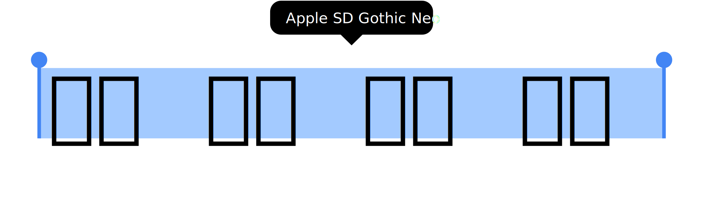

<div align="center">

[](#readme)

[](LICENSE "License")
[](#リリースファイル "リリースファイル")
[](https://github.com/devhaaana/radipy/commits "Commit History")
[](https://github.com/devhaaana/radipy/pulse/monthly "Last Commit")

</div>

<br />

<div align="center">

[ENGLISH](/README.md)  ·  [한국어](/documents/README-KR.md)  ·  [日本語](/documents/README-JP.md)

</div>

`apple-sd-gothic-neo`は、ウェブ開発者向けのApple SD Gothic Neoウェブフォントです。

## はじめに

### インストール

- **ローカル**にインストールする方法:
  ```bash
  $ git clone https://github.com/devhaaana/apple-sd-gothic-neo.git
  $ cd apple-sd-gothic-neo
  ```
- ダウンロードしたファイルをプロジェクトの任意のディレクトリに配置してください。

### 使用方法: CSS

- スタイルシートを**インポート** するには、メインの `.css` ファイルの上部に次のコードを追加してください:

```css
@import("/apple-sd-gothic-neo/css/apple-sd-gothic-neo.css");
```

または、

```css
@import("/apple-sd-gothic-neo/css/apple-sd-gothic-neo-local.css");
```

- body 要素または必要な要素にフォントを適用してください:

```css
// デフォルトのOSフォント
// Mac OS: -apple-system, BlinkMacSystemFont
// Windows: Segoe UI
// Android: Roboto

body {
  font-family: "Apple SD Gothic Neo";
}
```

### 注意事項

- フォルダのパスを変更する場合は、css/noto-sans-korean.css 内のパスを更新する必要があります。
  - デフォルトのフォルダ構成: `css/`, `fonts/`, `fonts/ttf/`, `fonts/woff2/`

## リリースファイル

| ファイル                                                                                       | 説明                                                           |
| ---------------------------------------------------------------------------------------------- | -------------------------------------------------------------- |
| [v1.0.0.zip](https://github.com/devhaaana/apple-sd-gothic-neo/archive/refs/tags/v1.0.0.zip)       | バージョン1.0.0の完全なソースコードを含む*ZIP* ファイル。    |
| [v1.0.0.tar.gz](https://github.com/devhaaana/apple-sd-gothic-neo/archive/refs/tags/v1.0.0.tar.gz) | バージョン1.0.0の完全なソースコードを含む*TAR.GZ* ファイル。 |

## ライセンス

```
Appleの標準フォントであるApple SD 山道ゴシック NeoのライセンスはすべてAppleが所有しており、Apple製品のユーザーは商業目的、非商業目的の両方で使用することができます。これはApple製品にデフォルトのバンドルフォントとして内蔵されており、商業利用が可能です。つまり、Apple製品のユーザーであれば、印刷、出版、映像制作など、商業目的に制限なく使用することができます。
```
