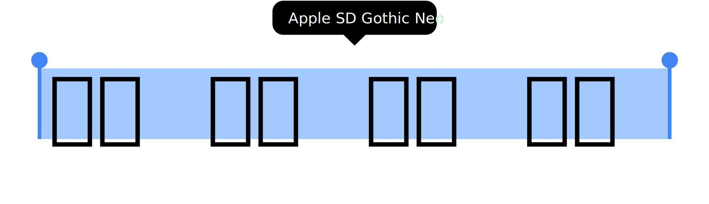

<div align="center">

[](#readme)

[](LICENSE "License")
[](#release-files "Release Files")
[](https://github.com/devhaaana/radipy/commits "Commit History")
[](https://github.com/devhaaana/radipy/pulse/monthly "Last Commit")

</div>

<br />

<div align="center">

[ENGLISH](/README.md)  ·  [한국어](/documents/README-KR.md)  ·  [日本語](/documents/README-JP.md)

</div>

`apple-sd-gothic-neo` 은 웹 개발자를 위한 Apple SD Gothic Neo 웹 폰트 입니다.

## 시작하기

### 설치

- **로컬** 설치:
  ```bash
  $ git clone https://github.com/devhaaana/apple-sd-gothic-neo.git
  $ cd apple-sd-gothic-neo
  ```
- 다운로드한 파일을 프로젝트의 원하는 경로에 넣어주세요.

### 사용 방법: CSS

- **Import** the stylesheet at the top of your main `.css` file:
- 프로젝트의 메인 `.css` 파일 상단에 다음과 같이 **import** 하세요:

```css
@import("/apple-sd-gothic-neo/css/apple-sd-gothic-neo.css");
```

또는

```css
@import("/apple-sd-gothic-neo/css/apple-sd-gothic-neo-local.css");
```

- `body` 또는 필요한 곳에 다음과 같이 폰트를 적용하세요:

```css
// OS 기본 폰트
// Mac OS: -apple-system, BlinkMacSystemFont
// Windows: Segoe UI
// Android: Roboto

body {
  font-family: "Apple SD Gothic Neo";
}
```

### 주의

- 폴더 경로를 변경할 경우 `css/apple-sd-gothic-neo-local.css` 파일에서 **경로를 변경**해야 합니다.
  - 기본 폴더 경로: `css/`, `fonts/`, `fonts/ttf/`, `fonts/woff2/`

## 릴리스 파일

| 파일                                                                                           | 설명                                            |
| ---------------------------------------------------------------------------------------------- | ----------------------------------------------- |
| [v1.0.0.zip](https://github.com/devhaaana/apple-sd-gothic-neo/archive/refs/tags/v1.0.0.zip)       | v1.0.0의 전체 소스 코드가 포함된*ZIP* 파일    |
| [v1.0.0.tar.gz](https://github.com/devhaaana/apple-sd-gothic-neo/archive/refs/tags/v1.0.0.tar.gz) | v1.0.0의 전체 소스 코드가 포함된*TAR.GZ* 파일 |

## 라이센스

```
애플 기본 폰트인 Apple SD 산돌고딕 Neo의 라이선스는 모두 애플이 가지고 있으며 애플 제품 사용자는 비상업, 상업 용도 모두 사용 가능합니다. 애플에서 기본 번들 폰트로 내장되어 있으며, 상업적으로 이용이 가능합니다. 즉, 애플 제품 사용자라면 인쇄, 출판, 영상 등 상업적 이용에 제한없이 사용 가능합니다.
```
